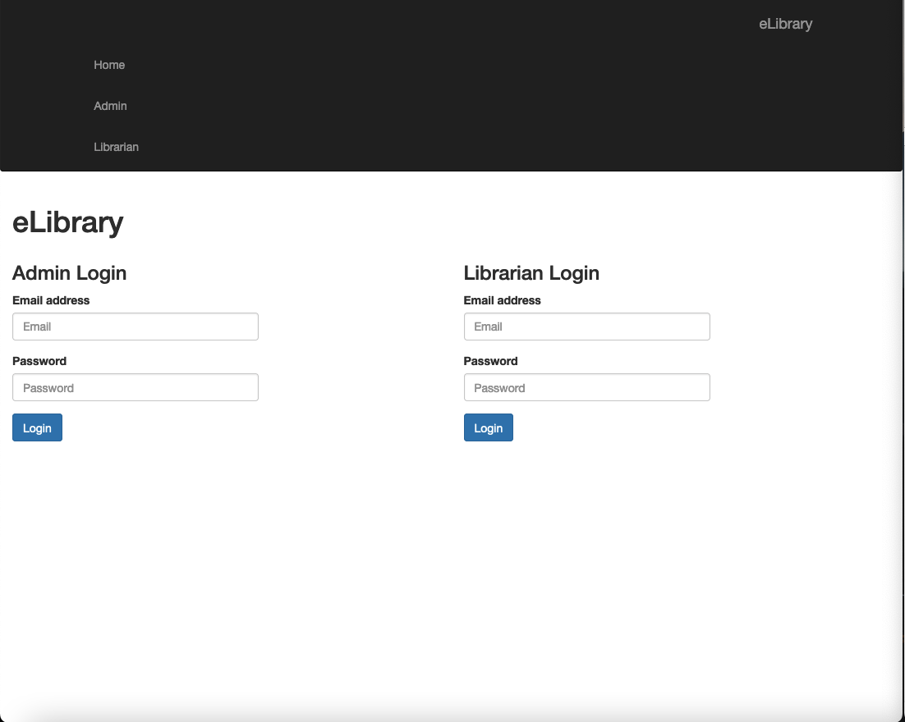

# Project Title: E Library System 

## 1. Project Description: 

This is an electronic library platform for managing the borrowing and return of books. 

It allows access to two types of users, with the following functions:

- Admin User: Log in, register Librarian, update Librarian, remove Librarian and log out.

- Librarian User: Log in, add books, view books, issue books, return books, delete books and log out.


## 2. Tech Stack:

- HTML / CSS / JavaSript / Bootstrap 5

- Java 11 / Java EE version 7 (Jakarta EE version 7)

- Java JSP

- Java Servlet

- JDBC Driver

- MySQL DB / MySQL Server / MySQL Workbench

- Apache Tomcat Server

- Apache Netbeans IDE


## 3. Installing:

Project Prerequisite: 
- Apache NetBeans 13.0, 
- Apache Tomcat Server 10.0, 
- MySQL Server, 
- MySQL Workbench (Optional ... I prefer to perform MySql operations on the command line "mysql -u root -p")
- Be mindful that you will need to add the following libraries to the project:

(a) mysql-connector-java-8.0.17.jar

(b) jsp-api.jar

(c) servlet-api.jar

- How to use:

1. Clone the repo.

```
https://github.com/AAdewunmi/E-Library-System.git
```

2. Database

- Start MySQL Server

- Create tables in MySQL (SQL queries are in /web/elibrary_DB.txt)

3. IDE:

- Open project in NetBeans

- Start Apache Tomcat Server

- Run the application in the IDE (NetBeans)

- On "eLibrary" landing page:

        (i) Login as an Admin:
        
        Admin username -> admin@unv.com
        
        Admin password -> admin123
        
Enjoy 😎

## 4. Contributing:

Pull requests are welcome. For major changes, please open an issue first to discuss what you would like to change.

Future plans!

👇 👇 👇

Implement the following: 

1. Librarian User: Any time a book is deleted in ViewBook Class, the same book should be removed from IssueBook Class.

2. Student User:  Log in, search for book(s), view books, borrow books, return books and log out.


## 5. Landing Page Screenshot:



## Adapted from:

UDEMY: Java Development Mega Course: Build Projects Practically

(Java Programming Course: Learn Development of JAVA Projects Using JSP, JDBC, Servlets, Swing, Spring Boot, Maven, Hibernate)

Project Name: Project 37: E Library System

Created by: Engineering.Org.In

Last updated: 03/2022

URL: https://www.udemy.com/course/build-real-world-java-projects-using-spring-jsp-jdbc/
