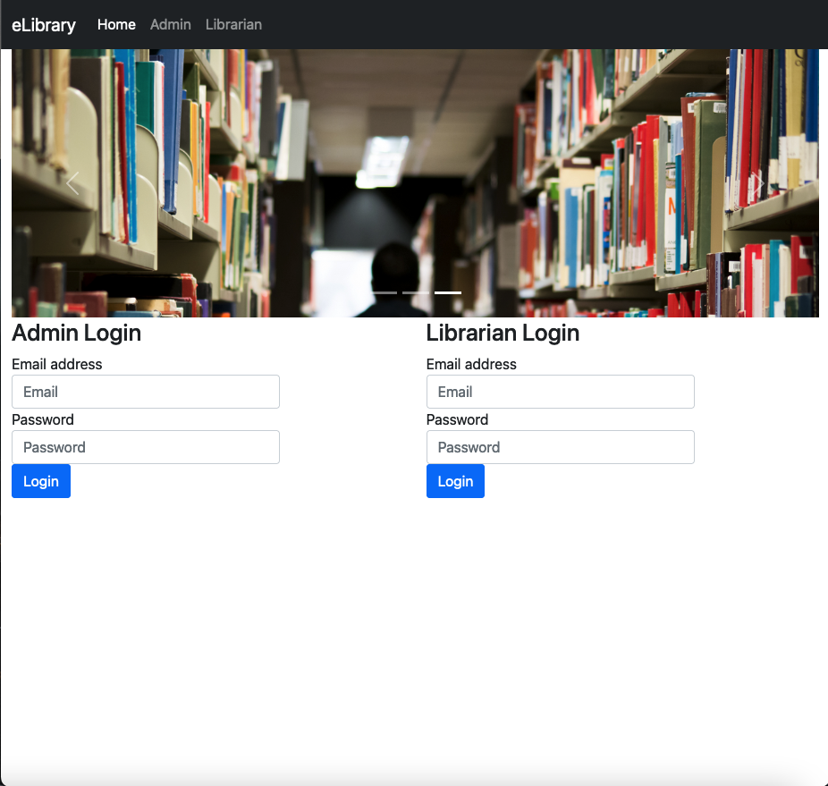

# Project Title: E Library System (WORK-IN-PROGRESS)

## What is the project?

This project aims to develop an electronic library application.

- Landing Page Screenshot

## Tech Stack:

- HTML / CSS / JavaSript / Bootstrap

- Java 11 / Java EE version 7 (Jakarta EE version 7)

- Java JSP

- Java Servlet

- JDBC Driver

- MySQL DB / MySQL Server / MySQL Workbench

- Apache Tomcat Server

- Apache Netbeans IDE

## What is the MVP?

The minimum viable product is an application that renders in web browsers 
that can allow two types of users to perform different operations:

1. Admin: Log in, register books, remove books and log out.
2. Student: Log in, borrow books, return books and log out.

## What are the sprinkles (Nice to haves)?

## When will the project be complete?

The project will be complete once all the MVP features have been implemented and the e library application has been styled.

## Adapted from:

UDEMY: Java Development Mega Course: Build Projects Practically

(Java Programming Course: Learn Development of JAVA Projects Using JSP, JDBC, Servlets, Swing, Spring Boot, Maven, Hibernate)

Project Name: Project 37: E Library System

Created by: Engineering.Org.In

Last updated: 03/2022

URL: https://www.udemy.com/course/build-real-world-java-projects-using-spring-jsp-jdbc/
